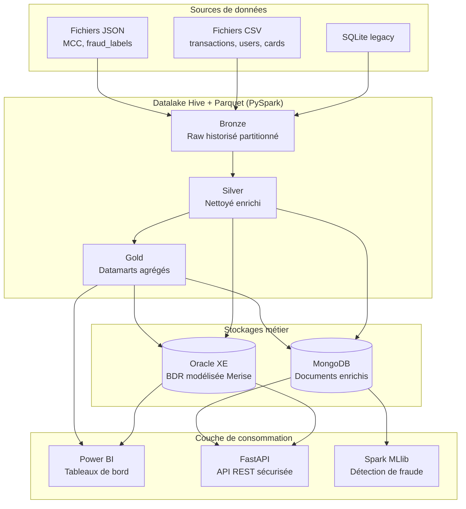

# Architecture cible

## Vue d'ensemble

L'architecture suit un pattern moderne de **polyglot persistence** : chaque brique est choisie pour ce qu'elle fait le mieux. Les données circulent depuis les sources legacy / opérationnelles, sont raffinées en 3 couches dans le datalake (médaillon), puis sont matérialisées dans deux paradigmes complémentaires (relationnel pour la source de vérité, document pour les usages analytiques et ML), enfin exposées aux consommateurs via une API REST et des outils BI.

## Schéma d'architecture

Voir le fichier [`architecture_cible.svg`](architecture_cible.svg) pour une version vectorielle haute qualité (à mettre dans les slides de soutenance).

Version Mermaid pour visualisation directe sur GitHub :

## Briques détaillées

### Couche 1 — Sources

| Source | Format | Volumétrie | Rôle dans le scénario |
|---|---|---|---|
| `legacy_db.sqlite` | SQLite | Variable | Système agences historique. Démontre la capacité à intégrer un legacy. |
| `transactions_data.csv` | CSV | 22 M lignes | Flux opérationnel principal des transactions. |
| `users_data.csv` | CSV | 2 000 lignes | Référentiel clients (KYC). |
| `cards_data.csv` | CSV | 6 146 lignes | Référentiel cartes bancaires. |
| `mcc_codes.json` | JSON | 109 entrées | Référentiel des catégories marchands. |
| `train_fraud_labels.json` | JSON | 8,9 M entrées | Labels supervisés pour le ML. |

### Couche 2 — Datalake médaillon

Le pattern **médaillon** (popularisé par Databricks) structure le datalake en 3 niveaux de raffinement :

- **Bronze** : copie brute des sources, historisée par `situation_date`, partitionnée pour les performances de lecture. Aucune transformation métier.
- **Silver** : données nettoyées (types, doublons, valeurs aberrantes traitées) et enrichies (jointures de référentiels), stockées sous forme de tables Hive managées + fichiers Parquet.
- **Gold** : datamarts agrégés et orientés cas d'usage, prêts pour la BI et l'API.

Toutes les couches utilisent **Parquet** comme format de stockage et **PySpark** comme moteur de transformation.

### Couche 3 — Stockages métier

Deux paradigmes complémentaires :

**Oracle XE** porte le **modèle de données métier normalisé**. Issu de la modélisation Merise, il garantit l'intégrité référentielle, supporte les requêtes complexes des outils internes et constitue la **source de vérité** auditée. Il accueille également les datamarts Gold sous forme de vues matérialisées.

**MongoDB** porte les **transactions enrichies sous forme de documents auto-portants**. Chaque document embarque les informations contextuelles (client, carte, marchand, MCC, label) pour permettre des requêtes rapides sans jointure côté API, et pour servir de base d'entraînement aux modèles ML.

### Couche 4 — Consommation

**FastAPI** expose des endpoints REST sécurisés (JWT) pour les applications partenaires et internes.
**Power BI** consomme les datamarts Gold et les vues Oracle pour les tableaux de bord métier.
**Spark MLlib** consomme les documents enrichis MongoDB pour entraîner et servir le modèle de détection de fraude.

## Évolutions Sprint 2

Le Sprint 2 ajoutera au-dessus de cette architecture :

- **Apache Kafka** en amont du Bronze pour le streaming temps réel
- **Spark Structured Streaming** comme consumer du topic transactions
- **Airflow** comme chef d'orchestre transverse de tous les traitements batch
- **MLflow** pour le tracking des modèles et leur serving
- **Prometheus + Grafana** pour l'observabilité
- **GitHub Actions** pour la CI/CD
- **Great Expectations** pour les contrôles qualité de données

## Décisions d'architecture (ADR — Architecture Decision Records)

Les principaux ADR sont documentés dans [`veille_technologique.md`](veille_technologique.md). Chaque ADR contient :

1. Le contexte du choix
2. Les options considérées
3. La décision retenue
4. Les conséquences (positives et négatives)
